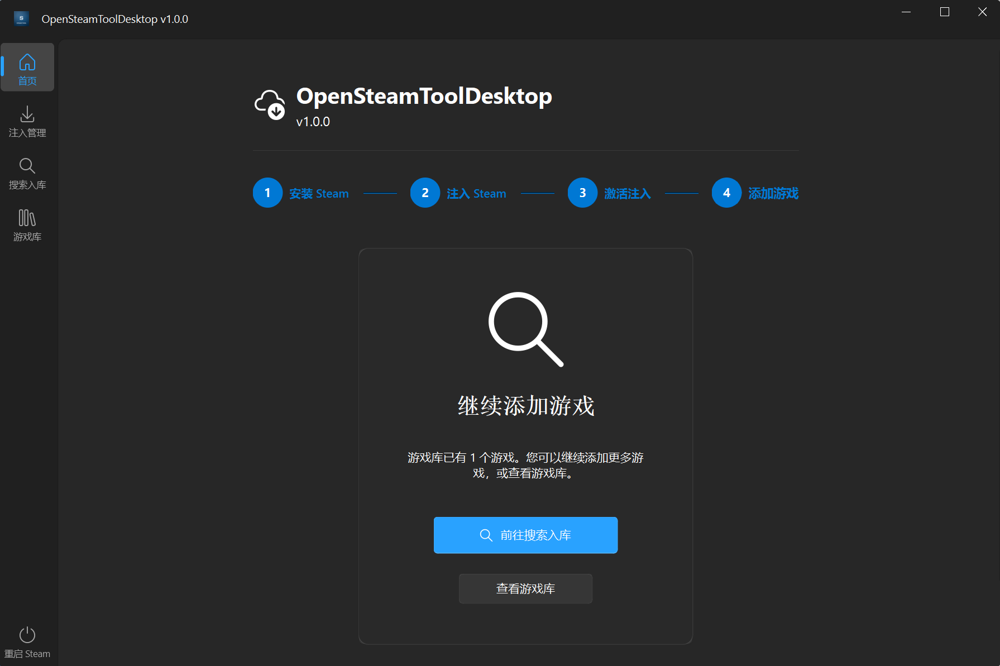
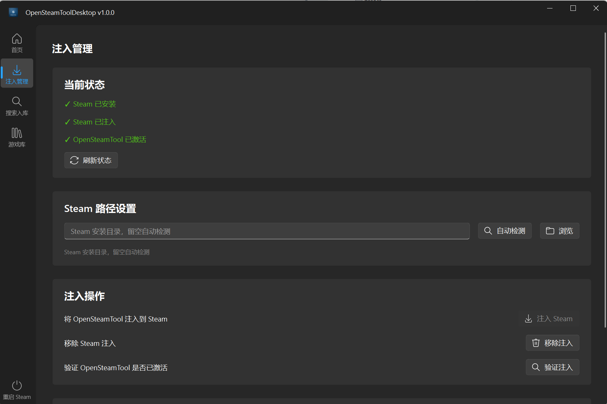
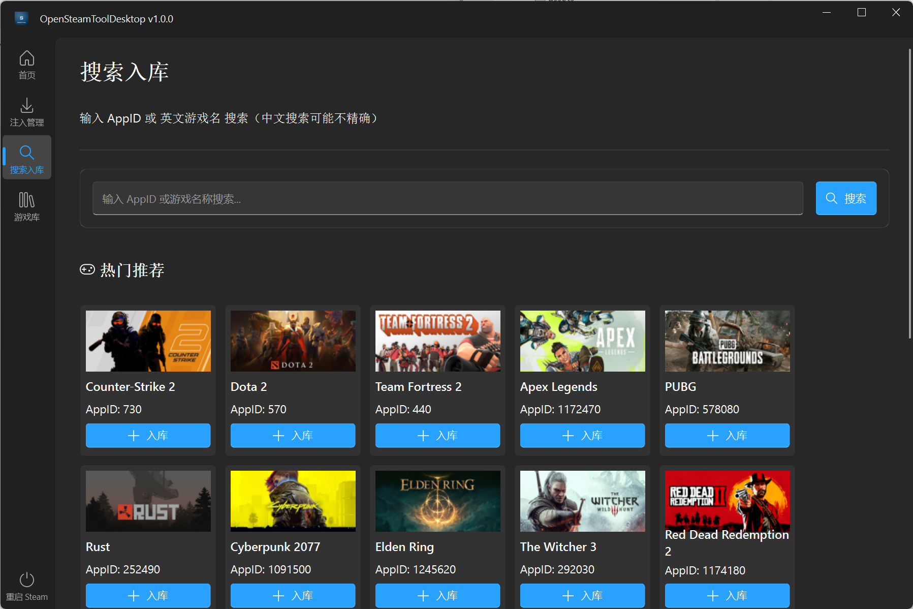
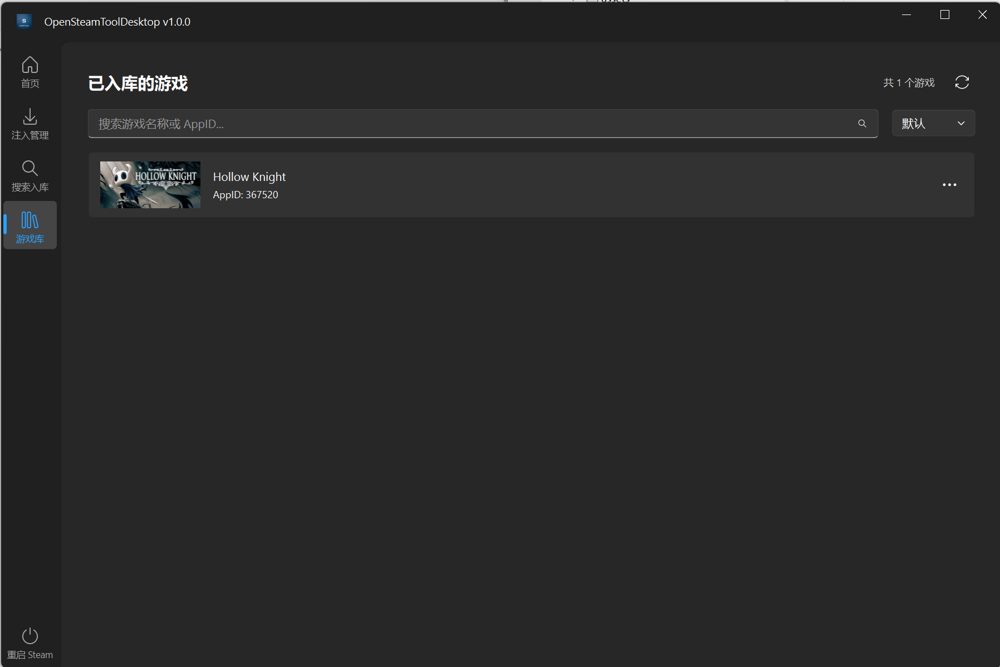
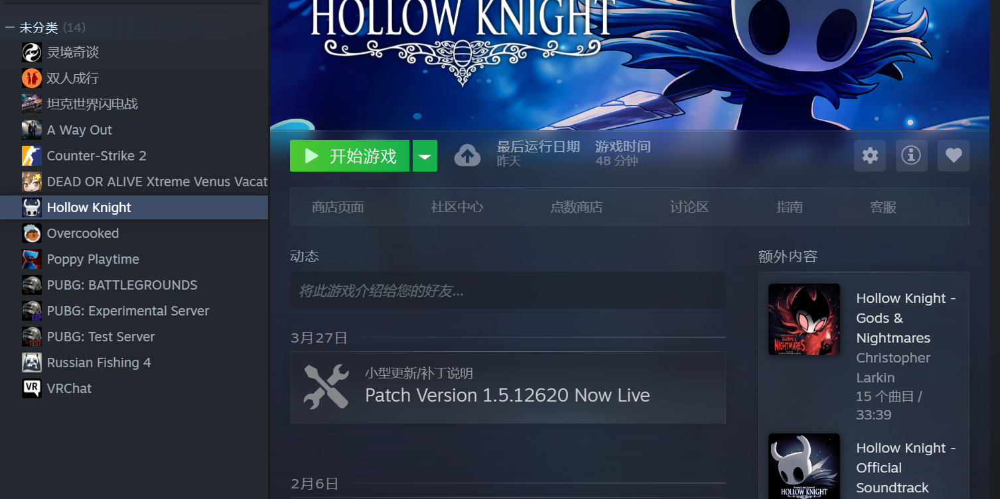
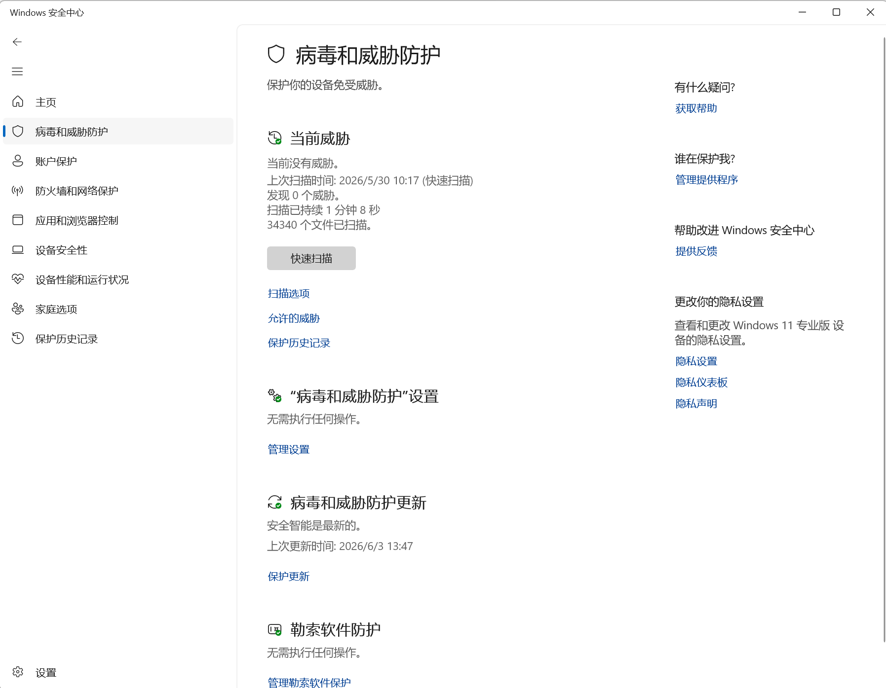
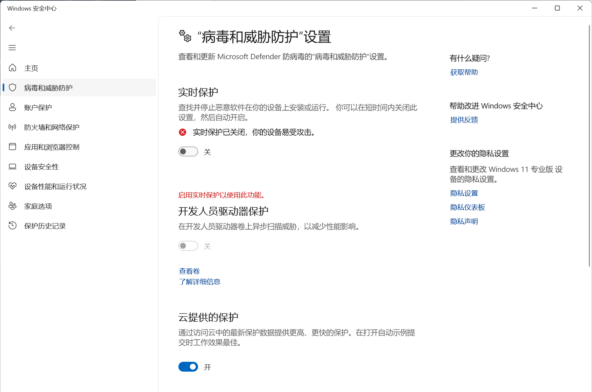

<h1 align="center">OpenSteamTool-Desktop</h1>

  基于 <a href="https://github.com/OpenSteam001/OpenSteamTool">OpenSteamTool</a> 的 Steam 游戏库管理桌面工具 
  Windows 11 Fluent Design 风格 GUI，一站式游戏解锁与管理体验

  
  
  
  
  

  <a href="README_EN.md">English</a>

---

> ⚠️ **仅支持 Windows 10 / Windows 11 64 位系统**，需要已安装 Steam 客户端并登录。不支持 macOS / Linux。

---

## 下载

前往 [Releases](https://github.com/yong0512/OpenSteamToolDesktop/releases) 页面下载最新版本。

---

## 目录

- [功能概览](#功能概览)
- [OpenSteamTool 底层能力](#opentool-底层能力)
- [首页概览](#首页概览)
- [使用指南](#使用指南)
- [入库效果](#入库效果)
- [安全软件提示](#安全软件提示)
- [常见问题](#常见问题)
- [免责声明](#免责声明)
- [开源许可](#开源许可)

---

## 功能概览

| 功能             | 说明                                                  |
| -------------- | --------------------------------------------------- |
| **注入管理**       | 一键部署/移除 OpenSteamTool DLL，三层验证确保注入状态准确，支持快捷重启 Steam |
| **游戏搜索入库**     | 按 AppID 或英文名称搜索 Steam 游戏，自动获取元数据并生成入库配置             |
| **DLC 全解锁**    | 自动识别游戏关联的 DLC 列表，一键全部入库                             |
| **Depot 解密密钥** | 自动获取每个加密 Depot 的专属解密密钥，确保游戏内容可正常下载                  |
| **游戏库管理**      | 卡片式浏览已入库游戏，支持排序、搜索、右键快捷操作（查看/复制/出库）                 |
| **版本自动更新**     | 启动时自动检测 GitHub Release 最新版本，确保始终使用最新版本              |

---

## OpenSteamTool 底层能力

OpenSteamTool 是通过 DLL 注入 Steam 客户端的 C++ 引擎，本工具为其提供图形化管理界面。注入后可实现：

| 能力               | 说明                                 |
| ---------------- | ---------------------------------- |
| **游戏解锁**         | 解锁未拥有的游戏及其全部 DLC                   |
| **Depot 解密**     | 自动注入 Depot 解密密钥，支持游戏文件正常下载         |
| **Manifest 下载**  | 自动下载 Depot Manifest，支持锁定特定版本防止自动更新 |
| **Access Token** | 支持需要访问令牌的受保护游戏/DLC                 |
| **统计与成就**        | 为未拥有游戏启用 Steam 统计和成就系统             |
| **热重载**          | Lua 配置文件修改后自动生效，无需重启 Steam         |

---

## 首页概览

启动后自动检测 Steam 安装状态、注入状态和游戏库概览：

---

## 使用指南

### 第一步：注入 Steam

1. 进入「注入管理」页面
2. 点击 **「注入 Steam」** 按钮
3. 重启 Steam 客户端即可生效

> 如果 Steam 正在运行，程序会自动提示关闭后继续。

### 第二步：搜索入库

1. 进入「搜索入库」页面
2. 输入游戏 **AppID**（如 `730` = CS2）或**英文游戏名**
3. 点击 **「入库」**，系统自动获取元数据、DLC 列表、解密密钥并生成配置

### 第三步：管理游戏库

1. 进入「游戏库」页面查看所有已入库游戏
2. 支持按名称/AppID 排序和搜索过滤
3. 右键游戏卡片可：复制 AppID、复制游戏名、在 Steam 中查看、出库

---

## 入库效果

入库成功后，游戏将直接出现在你的 Steam 游戏库中：

---

## 安全软件提示

如果 Windows 安全中心对程序报毒（DLL 注入行为可能触发误报），请按以下步骤处理：

1. 打开 Windows 安全中心

2. 点击「病毒和威胁防护」→「管理设置」

3. 关闭「实时保护」。Windows 安全中心对 DLL 注入类工具容易产生误报，关闭后可避免程序被拦截影响运行。

---

## 常见问题

### 注入后 Steam 没有变化？

请确保已**重启 Steam**。DLL 注入只在 Steam 启动时生效。可在「注入管理」页面点击「验证注入」检查状态。

### 游戏入库后提示「内容仍处于加密状态」？

部分 Depot 缺少解密密钥时会触发此提示。系统已自动获取解密密钥，如果仍有问题，请检查网络连接是否正常。

### 如何卸载注入？

在「注入管理」页面点击「移除注入」，然后重启 Steam。也可以手动删除 Steam 根目录下的三个 DLL 文件。

---

## 免责声明

本项目仅供**学习和研究**使用。请遵守以下原则：

- 本工具不提供游戏下载功能
- 请尊重游戏开发者的劳动成果，支持正版
- 使用本工具产生的任何后果由使用者自行承担
- 禁止将本工具用于任何商业用途

---

## 开源许可

本项目基于底层引擎 [OpenSteamTool](https://github.com/OpenSteam001/OpenSteamTool) 为开源项目。

---

## Star 走势

---

  Made with ❤️ for the Steam community

